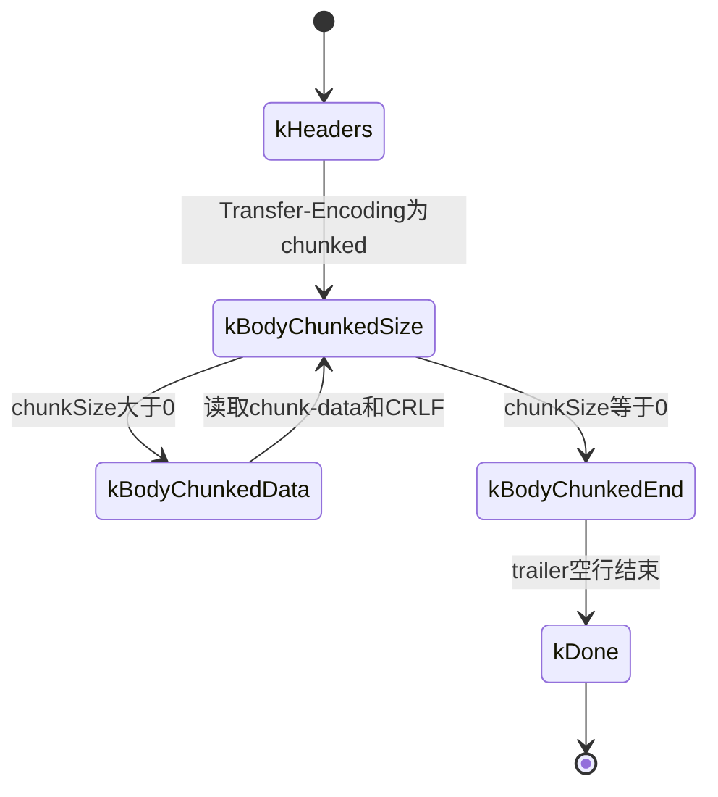

# 第5章 chunked 解码：状态转换与边界条件

本章只讨论“请求体 chunked 解码”（Transfer-Encoding: chunked）。本项目的 chunked 解析在 Http1Parser 内部实现，且对 trailer 有额外约束；这些细节是文档最容易与真实行为偏离的部分。

## 5.1 chunked 在本项目的触发条件

触发点在 headers 结束（遇到空行）之后：

- 读取 `Transfer-Encoding`，当其值与 `"chunked"` 大小写不敏感相等时进入 chunked 模式（见 [Http1Parser::Parse](file:///home/zsy/WebServer/cppBackend/http/src/parser/Http1Parser.cpp#L79-L103)）。
- 若同时出现 `Content-Length` 与 `Transfer-Encoding`，会在解析后的责任链校验阶段直接判定为 400（见 [ProtocolValidationHandler](file:///home/zsy/WebServer/cppBackend/http/src/handler/ProtocolValidationHandler.cpp#L7-L20)）。

## 5.2 状态机与转换（真实实现）

chunked 相关状态为：

- `kBodyChunkedSize`：按行读取并解析 chunk-size
- `kBodyChunkedData`：读取 chunk-data + 末尾 CRLF
- `kBodyChunkedEnd`：解析 trailer（按行），直到空行结束

实际转换逻辑集中在 [Http1Parser::Parse](file:///home/zsy/WebServer/cppBackend/http/src/parser/Http1Parser.cpp#L40-L330)。

## 5.3 chunk-size 解析规则（与 RFC/常见实现的差异点）

chunk-size 解析由 [Http1Parser::ParseChunkSize](file:///home/zsy/WebServer/cppBackend/http/src/parser/Http1Parser.cpp#L415-L431) 完成：

- 仅读取行首连续的十六进制数字；
- 后续的 chunk-ext（如 `;foo=bar`）会被忽略，不参与解析；
- 若行首无任何十六进制数字 → `ERROR`。

## 5.4 chunk-data 的完整性要求

在 `kBodyChunkedData` 状态：

- 必须一次性拥有完整的 `chunkSize_` 字节数据以及随后 2 字节 `\r\n`；
- 若剩余数据不足（拆包/半包），返回 `NEEDMOREDATA`；
- 若 chunk-data 后不是 `\r\n`，直接 `ERROR`（见 [Http1Parser::Parse](file:///home/zsy/WebServer/cppBackend/http/src/parser/Http1Parser.cpp#L208-L234)）。

## 5.5 trailer 的限制与白名单

本项目对 trailer 的处理要点：

- 若请求头包含 `Trailer`，解析器会把其声明的字段名收集为白名单（统一小写），见 [Http1Parser::Parse](file:///home/zsy/WebServer/cppBackend/http/src/parser/Http1Parser.cpp#L86-L99)。
- 在 trailer 解析阶段：
  - 禁止 `Transfer-Encoding`/`Content-Length`/`Trailer` 出现在 trailer 中；
  - 若白名单非空，trailer key 必须在白名单内，否则 `ERROR`；
  - 若白名单为空，则仅执行“禁止字段”规则与基本格式校验（必须含冒号等）。
  - 具体逻辑见 [Http1Parser::Parse](file:///home/zsy/WebServer/cppBackend/http/src/parser/Http1Parser.cpp#L275-L310)。

## 5.6 错误码与上层映射

- chunked 解析错误会导致 Http1Parser 返回 `ParseResult::ERROR`。
- HttpFacade 会把该错误映射为 `HttpErrc::PARSE_INVALID_CHUNKED_ENCODING` 并返回 `HttpServerResult::PARSE_FAILED`（HTTP 状态码为 400），见 [HttpFacade::ProcessParsing](file:///home/zsy/WebServer/cppBackend/http/src/HttpFacade.cpp#L246-L268)。

