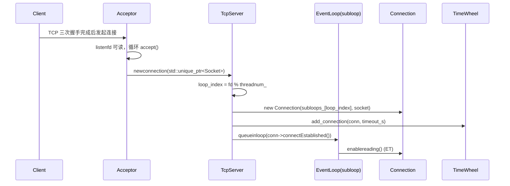
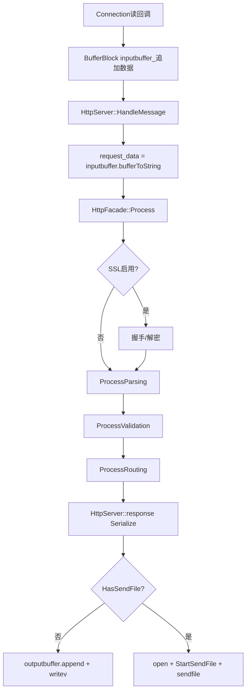
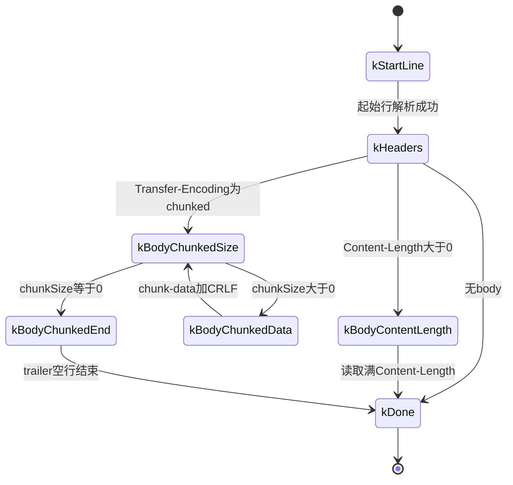
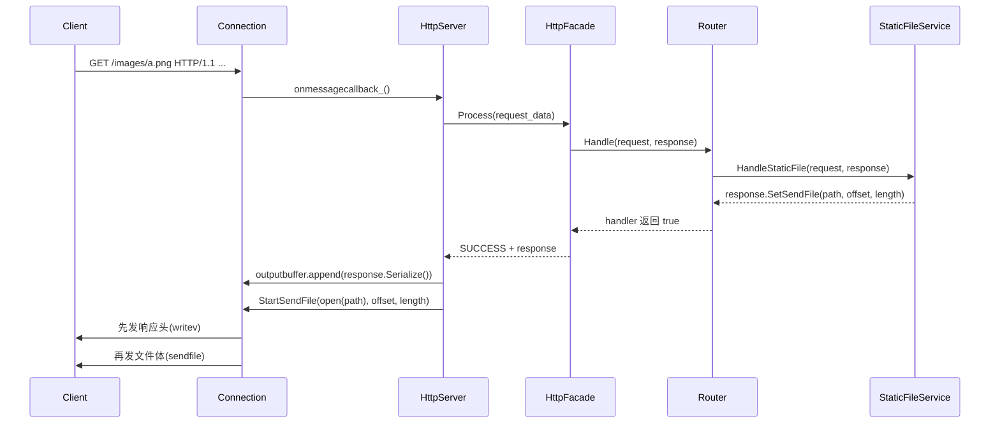
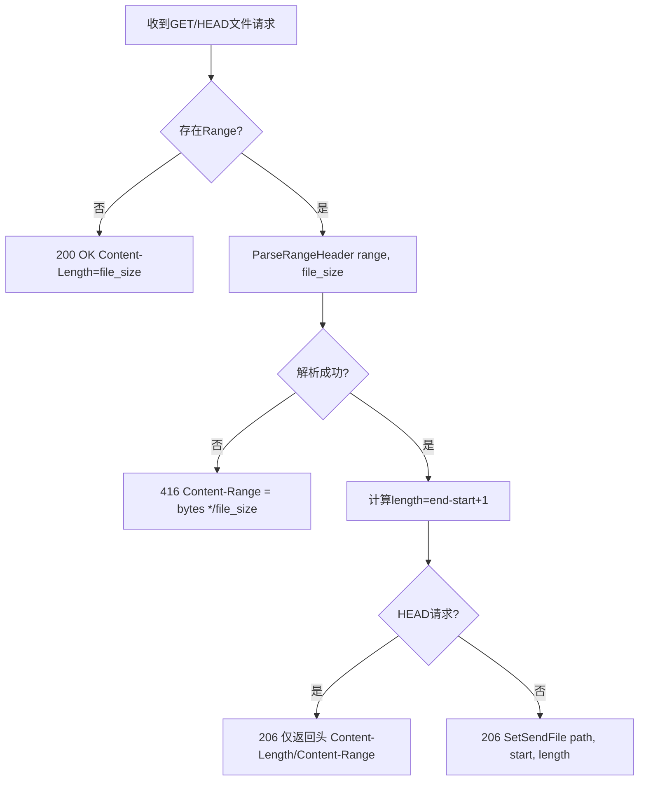
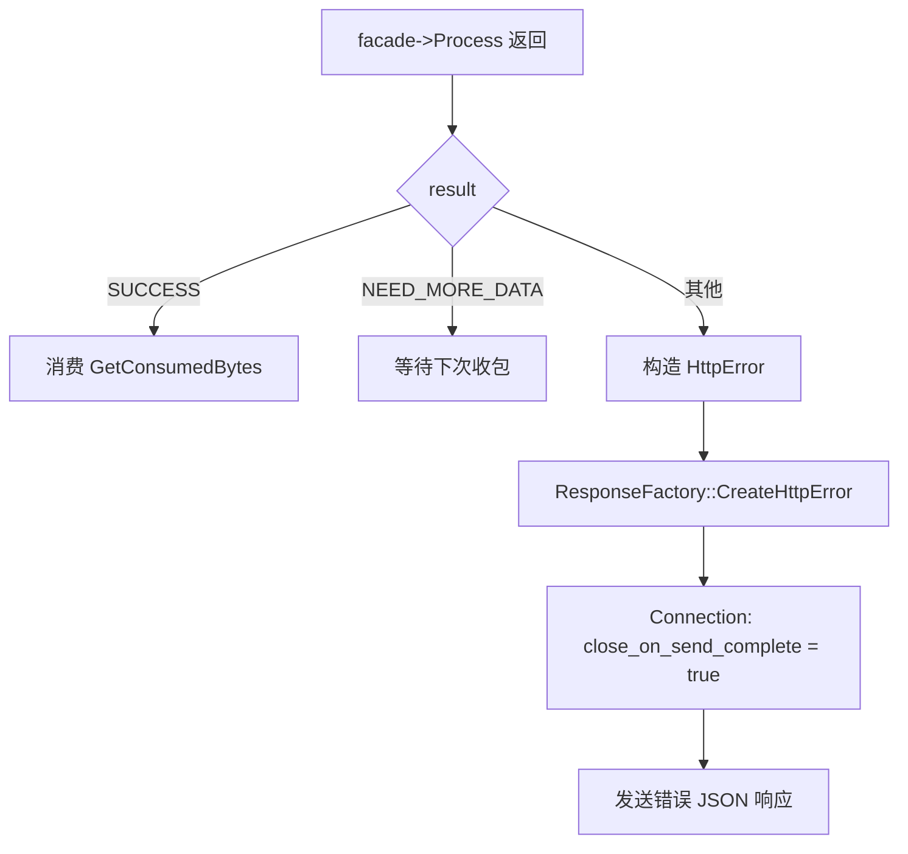

# HTTP请求解析技术文档 - 图表汇总

本文件仅提供“与源码一致”的流程图与状态机图，便于快速沟通调用链与关键边界条件。

## 1. TCP 接入与连接分配（Acceptor → TcpServer → subloop）

## 2. HTTP 处理管线（HttpServer → HttpFacade）

## 3. Http1Parser 状态机（真实状态）

## 4. GET 静态文件（路由命中 → SetSendFile → sendfile）

## 5. Range（单范围）处理流程

## 6. 错误回包与连接处理（真实分支）

