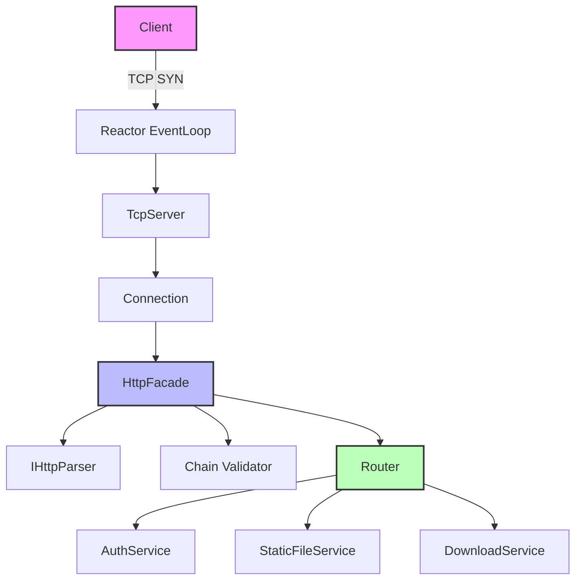

# HTTP请求解析技术文档

## 目录

1. [TCP连接建立与连接管理](chapter1.md)
2. [HTTP解析入口、状态机与缓冲区](chapter2.md)
3. [GET请求处理：路由与静态文件](chapter3.md)
4. [POST请求体读取：Content-Length 与 chunked](chapter4.md)
5. [chunked 解码：状态转换与边界条件](chapter5.md)
6. [下载请求：Range/缓存头/sendfile](chapter6.md)
7. [错误处理与超时控制](chapter7.md)
8. [并发模型与内存管理要点](chapter8.md)
9. [图表汇总](diagrams.md)

---

## 文档概述

本文档围绕本仓库的 C++ HTTP 服务器实现，描述从网络层字节流到 HttpRequest/HttpResponse 的解析、校验、路由与响应输出链路。文档内容以源码行为为准：不引入仓库中不存在的“伪实现/伪接口”，并以可跳转的源码链接作为最终依据。

### 目标读者
- HTTP服务器开发工程师
- 网络协议栈优化工程师
- 系统架构师
- 性能调优专家

### 技术栈
- **语言**: C++17
- **网络框架**: Reactor + epoll（ET）
- **缓冲区**: BufferBlock（底层使用 MemoryPool）
- **HTTP解析**: HttpFacade + HttpParseFactory + Http1Parser/Http2Parser（按数据嗅探创建解析器）
- **校验链**: HandlerChain（ProtocolValidationHandler / SecurityValidationHandler）
- **路由**: Router（静态路由 + Trie 参数/通配路由）

### 术语表

| 术语 | 全称 | 说明 |
|-----|-----|------|
| Reactor | 反应器模式 | 事件驱动的网络编程模式 |
| HttpFacade | HTTP门面类 | 连接级HTTP状态管理器 |
| IHttpParser | HTTP解析器接口 | 字节流到HTTP消息的转换器 |
| BufferBlock | 分块缓冲区 | Connection 输入/输出缓冲区实现 |
| Chunked | 分块传输编码 | Transfer-Encoding: chunked |
| sendfile | 零拷贝发送 | 内核态文件传输优化 |
| Range | 范围请求 | HTTP/1.1部分内容请求 |
| ETag | 实体标签 | 资源版本标识符 |
| TimeWheel | 时间轮 | TCP 空闲连接超时回收策略 |

### 参考规范
- RFC 9110: HTTP Semantics
- RFC 9112: HTTP/1.1
- RFC 9113: HTTP/2
- RFC 9114: HTTP/3

---

## 架构拓扑

---

*本文档基于代码版本: 2026-03-07*
*最后更新: 2026-03-07*
